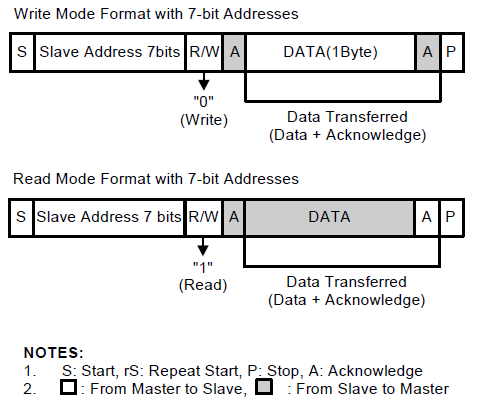
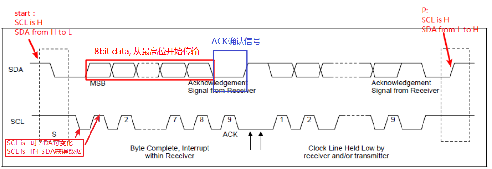

# 1. 原理

### 1.1 i2c协议

1. i2c是一种主从结构的传输协议，一般为一主多从。s3c2440支持多主机，但是在某一时间段，只能工作1个主机。

2. I2C有2条双向串行线，数据线SDA，时钟线SCL

3. 数据格式：8个数据位，1个ACK确认位，数据从最高位开始传输

   

4. 每个从设备有固定的物理地址，7bit

### 1.2 时序图

1. start：SCL为高电平，SDA由高变低（主）

2. 主机发出addr（7bit）, W/R（1bit），从机发出ACK确认信号，表示存在该从机

3. 发送方（主/从）发送8位数据，接收方（从/主）收到回一个ACK确认信号 在ACK信号后，会产生一个I2C中断（在此期间，谁也不能使用i2c总线）： 1. Transmitter mode：在新数据被写进IIC-bus Data Shift (IICDS)前，SCL 维持LOW 2. Receive mode       ：在新数据被从IIC-bus Data Shift (IICDS)读走前，SCL 维持LOW

4. 循环第3步，直到主机发出一个P信号停止I2C传输

### 1.3 读写过程

# 2. 实现
