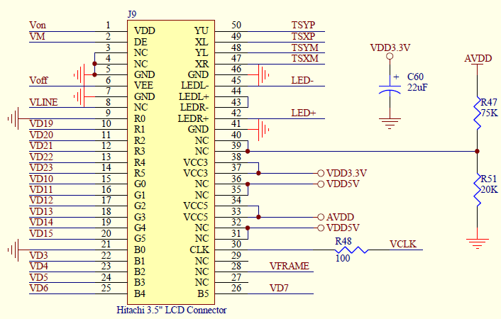
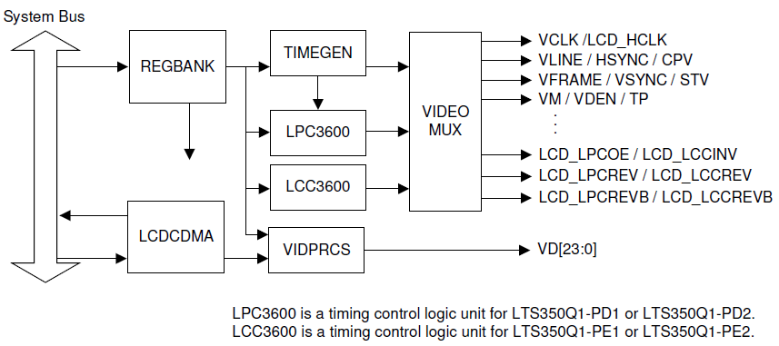
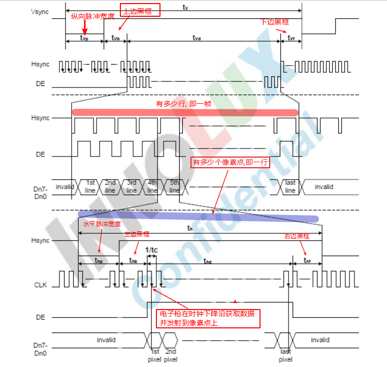
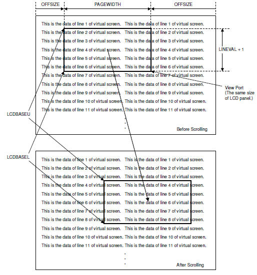

# 1. 原理

### 1.1 lcd_controller介绍

* S3C2440A的lcd_controller包含一个逻辑单元，它能将存储在系统内存video buffer中的image信息传输到外部lcd设备中  S3C2440A支持：     STN LCD     TFT LCD：1、2、4、8bpp的调色板接口，以及16、24bpp的无调色板真彩显示

* 上图是lcd原理图 其中：VDD :              DE   :              VEE :              R0-B5 : 数据口             CLK :              YU :              XL :              YL :              XR : 

* 上图是lcd_controller的运行过程图，具体过程如下：

1. REGBANK：拥有17个可编程寄存器集和256x16调色板内存，用于配置lcd控制器。

2. TIMEGEN：包含可编程的逻辑单元以支持外部不同的lcd driver的不同接口时序和速率，它能产生VFRAME、VLINE、 VCLK、 VM等信号。

3. 当我们把video data写入相应的显存(即video buffer)中时，

4. LCDCDMA是lcd_controller专用的DMA通道。当LCDCDMA中的FIFO为空或部分空时，它会获取总线的控制权，将video buffer中的data传输到FIFO中。LCDCDMA有2个FIFO，主要用于双扫描模式，单扫描模式下只用一个。

5. VIDPRCS将FIFO中的数据转换成合适的格式并将其发送至`VD[23:0]`，最后数据就会显示在lcd上。

* 上图是lcd芯片手册中的时序图

1. 一开始，发出Vsync低信号并保持tvp时间，Vsync拉高，再过tvb，此时DE信号使能，同时，拉低Hsync信号并保持thp，再过thb，电子枪开始获取数据，在CLK信号的下降沿获取数据并发射到lcd屏的像素点上。

2. 经过thd，lcd屏上一行数据接收并发送完毕，再经过thf，Hsync信号再次拉低，开始第二行的数据接收并发射。然后循环上述操作，直到最后一个像素点的数据打印在屏幕上。

3. 当最后一个像素点的数据打印在屏幕上后，再过tvf后，Vsync信号拉低，一帧的数据接收并发射完毕，开始发射下一帧的视频数据。如此往复循环……

### 1.2 Features

1. **虚拟显示（virtual display）**

* 上图便是虚拟显示的示意图

* 定义：所谓的虚拟显示就是，如果当前有一张很大的图片，但是在4.3寸的屏幕上无法完全显示，它支持只显示图片的一部分，但是可以通过移动窗口来达到浏览全图的目的。

* 原理：当我们划动屏幕时，视口的开始地址和结束地址会相应的变化，但是PAGEWIDTH和OFFSIZE是不变的，从而达到浏览全屏的效果。

# 2. 实现

### 2.1 步骤

1. 初始化lcd相关的PIN，eg. 背光引脚、lcd数据引脚、电源使能引脚etc

2. 根据LCD datasheet中各个时序参数，设置lcd controller的相应的时序参数，eg. tvp/thp/tvb etc

3. 设置数据格式、引脚信号极性，eg. 获取数据时电平变化方向、数据格式（565、555I）

4. 设置显存frame buffer的始末地址，外设LCD的xres/yres/bpp

5. 使能LCD controller，即可操作lcd屏幕画线等。 注意：在屏幕上显示图片或文字，都是点亮相应的像素点，因此一切画图的最基本的操作都是画点。

### 2.2 代码

* 4.3 寸TFT（见github/arm_hd/learn_s3c2440）

* 虚拟显示（待实现）

