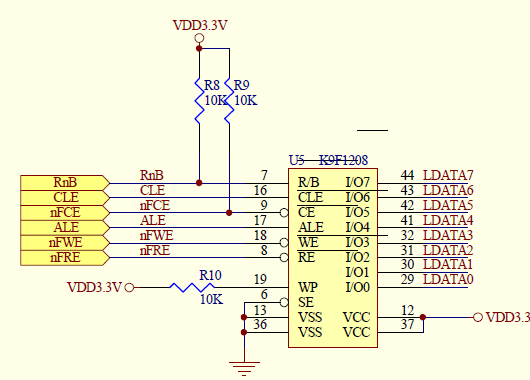
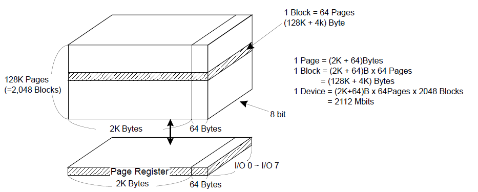

# 1. nand_flash

* nand flash(下文简称为nand)是一种非易失性存储元件，典型的如EPROM、EEPROM、NOR FLASH和NAND FLASH， 前两种已被淘汰。

*   下表是nand和nor的差别:

| 指标            | nand                    | nor（MLC）     |
| ------------- | ----------------------- | ------------ |
| 存储量           | 大(256M)                 | 小 (2M)       |
| 价格            | 便宜                      | 贵            |
| 烧写速度          | 快（SLC=8, MLC=2.4MB/s）   | 慢（0.47MB/s）  |
| 擦除速度          | 快（2ms）                  | 慢（900ms）     |
| 读取速度          | 慢（SLC=24, MLC=18.6MB/s） | 快（103MB/s）   |
| 位反转           | 有                       | 无            |
| 坏块(bad block) | 有                       | 无            |
| 使用寿命          | 100万次擦写                 | 10万次擦写       |
| 接口            | 特殊接口（顺序访问）              | 内存接口（随机访问）   |
| 用途            | 存放program/data          | 存放uboot等启动程序 |

# 2. 结构




* IO1~IO7：复用， 传输命令、地址、数据

* RnB：状态位，读它可知当前的读写操作是否完成

* CLE：命令锁存，当CLE ＝ H时，IO接口上传输的是命令

* ALE：地址锁存，当ALE ＝ H时，IO接口上传输的是地址

  * 当ALE = L && CLE = L时，IO接口上传输的是数据

* nFCE：片选

* nFWE/nFRE：写/读信号

* WP：写保护

* SE：



* 以可用内存为256M的nand为例：

```
1 device = 2048 blocks
         = 2048 blocks * (64 pages)
         = 2048 blocks * (64 pages) * (2K + 64)B
         = 256M + 8M
 其中：   256M是可用内存，8M是OOB（out of bank）, 用于ECC
```

# 3. 操作

### 3.1 读

* 初始化

  * 根据cpu和nand的时序图，设置相关时序参数，并使能nand

* 读操作

  * 片选选中

  * 发出命令

  * 发出地址

  * 读数据

### 3.2 写

* 写操作必须在擦除之后才能进行，因为nand只能将1变成0，想要写必须先清为1

* 写操作

  * 片选选中

  * 发出命令

  * 发出地址

  * 写入相应的数据

### 3.3 擦除

* 擦除最小单位：nand一次性擦除1 block

# 4. ECC (Error Correcting Code)
