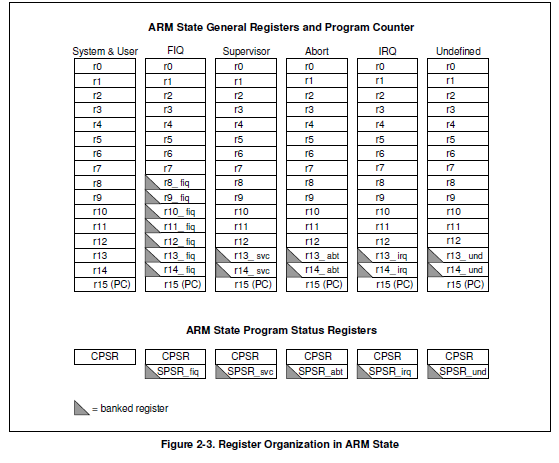
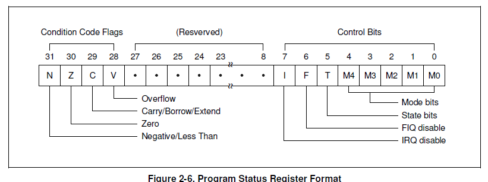
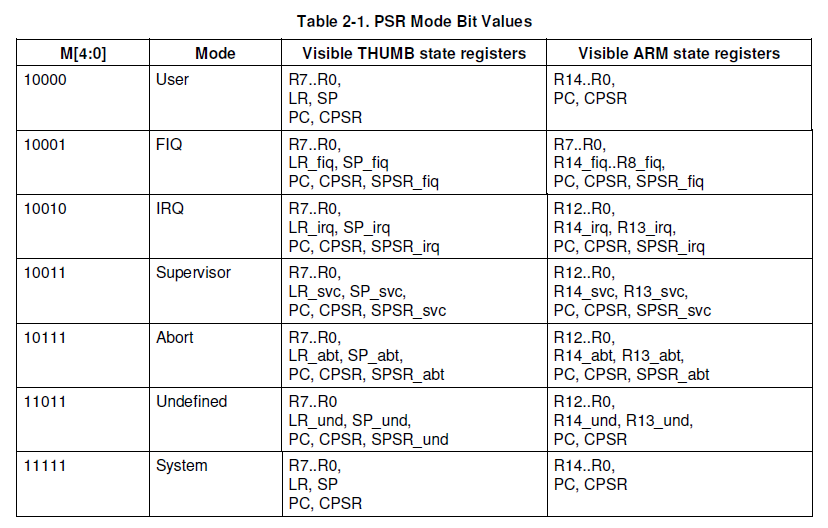

# 1. MSR和MRS指令介绍
	MRS指令:对状态寄存器CPSR和SPSR进行读操作。通过读CPSR可以获得当前处理器的工作状态。
			读SPSR寄存器可以获得进入异常前的处理器状态（因为只有异常模式下有SPSR寄存器）。
	MSR指令:对状态寄存器CPSR和SPSR进行写操作。与MRS配合使用，可以实现对CPSR或SPSR寄存器的读-修改-写操作，
			可以切换处理器模式、或者允许/禁止IRQ/FIQ中断等。
			(CPSR: current program status register, SPSR: saved program status register)
eg: s3c2440 r_o in ARM state
 
eg: s3c2440的psr format
 
eg: s3c2440 mode bit set
 

	eg1: 写操作
		msr cpsr_c, #0xd2       @0xd2=1100 0010 //禁止中断使能,进入中断模式
		msr cpsr_c, #0x53       @0x53=0101 0011 //开IRQ中断，禁止FIQ中断，进入ARM状态，设为管理(svc32)模式
		其中：  cpsr_c是因为CPSR有4个8位区域：
				C 控制域屏蔽字节([7:0])
				X 扩展域屏蔽字节([15:8])
				S 状态域屏蔽字节([23:16])
				F 标志域屏蔽字节([31:24])
				所以cpsr_c表示的是CPSR控制位

	eg2: cpsr无法直接修改，需借助通用寄存器
		mrs  r0,cpsr         //读状态寄存器cpsr的数据到r0中
		bic  r0,r0,#0x1f     //对r0低5位进行清0，清除模式位
		orr  r0,r0,#0xd3     //低8位或(110 10011), 设为管理(svc32)模式,禁止IRQ和FIQ中断
		msr  cpsr,r0         //写入状态寄存器cpsr，更新。

	eg3: 当从一个mode切换至另一个mode, 以下操作都可以从SPSR恢复CPSR
		movs pc, #0xff               // cpsr = spsr; pc = 0xff
		adds pc, r1, #0xffffff00     //cpsr = spsr; pc = r1 + 0xffffff00
		ands pc, r1, r2              //cpsr = spsr; pc = r1 & r2;
		ldmia   sp!,{ r0-r12,pc }^   //中断返回, ^表示将spsr的值复制到cpsr
