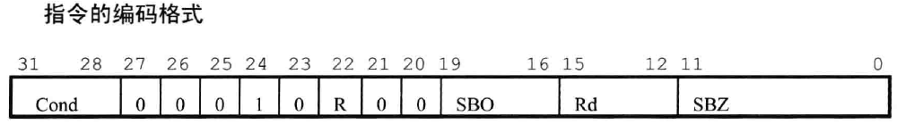

# 1. 跳转指令
　
        范围：跳转指令，跳转范围在[-32M， 32M]
* b / bl 

        语法：b cond des_addr
              bl cond des_addr
        涵义：跳转至目标地址des_addr执行
        区别：b    仅仅是跳转
             bl   跳转且保存pc到lr，调用完程序能返回

        eg: b Label1       //跳到Label1执行
            bcc Label      //if cpsr_c == 1, then 跳到Label1执行
            bl func_1      //跳到子程序func_1, 执行完返回
* bx

        语法：bx cond Rm
        涵义：跑到Rm(dest_addr)执行指令
              if (Rm_bit[0] == 0)
              目标地址为arm指令
              else
              目标地址为thumb指令
* blx
  * blx(1)
  
        语法：blx cond dest_addr
        涵义：跳到dest_addr执行指令
             设置T_flag ＝ 1，thumb指令
             令lr = pc
  * blx(2)
  
        语法：blx cond Rm
        涵义：跳到Rm(dest_addr)执行指令
             T_flag ＝ Rm_bit[0]，什么指令取决于Rm_bit[0]
             令pc = Rm & 0xfffffffe
               lr = pc
************************
* ldr pc, =0xffffffff

        语法：ldr pc, =0xffffffff
        涵义：跳到0xffffffff执行
        范围：可以实现4GB空间任意跳转
        如果前面指令为 mov lr, pc  则可以实现子程序调用

# 2. 数据处理指令
* mov

        语法：mov cond S Rd, shift_operand
        涵义：Rd = shift_operand
              cond：条件码，1则执行，0则不执行；没有cond则为无条件执行
              S：有S则更新CPSR相应位，无则不更新
              Rd：目标寄存器
              shift_operand：向Rd中传送的数据，有相应的计算方法

        eg: mov	ip, sp
            mov	sp, #868220928
* mvn

        语法：mvn cond S Rd, shift_operand
        涵义：Rd = ~shift_operand

        用途: 1. Rd = 一个负数
              2. 生成位掩码
              3. 求一个数的反码

        eg: mvn	r2, #11

********************************
* add

        语法：add cond S Rd, Rn, shift_operand
        涵义：Rd = Rn + shift_operand, 根据结果更新CPSR条件位
* adc

        语法：adc cond S Rd, Rn, shift_operand
        涵义：Rd = Rn + shift_operand + C_flag, 根据结果更新CPSR条件位

        add和adc联用可以实现2个64位数相加
        eg: adds r4, r0, r2
            adc r5, r1, r3
            其中：r0, r1存放一个64位数，r0 = low_32bit
                 r2, r3存放一个64位数，r2 = low_32bit
        eg: add r3, r0, r3
            add r3, r3, #48     //r3 = r3 + #48
            add Rs, pc, offset  //生成基于pc的跳转指针
* sub

        语法：sub cond S Rd, Rn, shift_operand
        涵义：Rd = Rn - shift_operand, 根据结果更新CPSR条件位

        eg: sub	fp, ip, #4
            sub	r0, r4, #4
* sbc

        语法：sbc cond S Rd, Rn, shift_operand
        涵义：Rd = Rn - shift_operand - ~(C_flag), 根据结果更新CPSR条件位

        类似的：sub和sbc联用可以实现2个64位数相减

* rsb

        语法：rsb cond S Rd, Rn, shift_operand
        涵义：Rd = shift_operand - Rn, 根据结果更新CPSR条件位
* rsc

        语法：rsc cond S Rd, Rn, shift_operand
        涵义：Rd = shift_operand - Rn - ~(C_flag), 根据结果更新CPSR条件位

        类似的：rsb和rsc联用可以实现求1个64位数的负数
        eg: rsbs r2, r0, #0
            rsc r3, r1, #0
            其中：64位数存放在r0, r1, r0 = low_32bit
                  负数存放在  r2, r3, r2 = low_32bit
*************************
* and

        语法：and cond S Rd, Rn, shift_operand
        涵义：Rd = Rn & shift_operand, 根据结果更新CPSR条件位
        用于提取Rn中某几位的值
* orr

        语法：orr cond S Rd, Rn, shift_operand
        涵义：Rd = Rn | shift_operand, 根据结果更新CPSR条件位
        用于将寄存器中的某些位设为1

        eg: mov r0, r2, lsr #24     //将r2的高8位送入r0, r0的高24位为0
            orr r3, r0, r3, lsl #8  //r3 << 8, r3低8位为0, orr操作将r0低8位送入r3
* eor

        语法：eor cond S Rd, Rn, shift_operand
        涵义：Rd = Rn ^ shift_operand, 根据结果更新CPSR条件位
        用于将寄存器中的某些位取反
* bic

        语法：bic cond S Rd, Rn, shift_operand
        涵义：Rd = Rn & ~shift_operand, 根据结果更新CPSR条件位
        用于将Rn中某几位值清零

        eg: bic R0, R0 , #0xF0000000     //将R0高4位清零
***************************
* cmp

        语法：cmp cond S Rn, shift_operand
        涵义：Result = Rn - shift_operand, 根据Result更新CPSR相应条件位，则后面的指令就能根据CPSR状态执行了
* cmn

        语法：cmn cond S Rn, shift_operand
        涵义：Result = Rn + shift_operand, 根据Result更新CPSR相应条件位，则后面的指令就能根据CPSR状态执行了
* tst

        语法：tst cond S Rn, shift_operand
        涵义：Result = Rn & shift_operand, 根据Result更新CPSR相应条件位，则后面的指令就能根据CPSR状态执行了

        用于检测寄存器中某些位是0 或 1
* teq

        语法：teq cond S Rn, shift_operand
        涵义：Result = Rn ^ shift_operand, 根据Result更新CPSR相应条件位，则后面的指令就能根据CPSR状态执行了

        用途：1. 比较2个数是否相等，该操作不影响CPSR的V_flag, C_flag
              2. 比较2个数符号是否相同，该操作执行后，CPSR中N_flag为2个数符号位异或结果
# 3. 乘法指令
* mul

        语法：mul cond S Rd, Rm, Rs
        涵义：Rd = Rm * Rs, 根据结果更新CPSR条件位
              S：有则设置CPSR的N_flag, Z_flag
        用途：2个32位数(unsigned or signed)相乘，结果为64位，但只保存低32位，所以结果对于unsigned or signed一样
* mla

        语法：mla cond S Rd, Rm, Rs, Rn
        涵义：Rd = Rm * Rs + Rn, 根据结果更新CPSR条件位
              S：有则设置CPSR的N_flag, Z_flag
        用途：2个32位数(unsigned or signed)相乘再加上1个32位数，结果为64位，但只保存低32位，所以结果对于unsigned or signed一样
*****************
* smull (signed)

        语法：smull cond S RdLo, RdHi, Rm, Rs
        涵义：RdHi = (Rm * Rs)[63:32]
              RdLo = (Rm * Rs)[31:0]
              根据结果更新CPSR条件位
* smlal (signed)

        语法：smulal cond S RdLo, RdHi, Rm, Rs
        涵义：RdHi = (Rm * Rs)[63:32] + RdHi + C_flag
              RdLo = (Rm * Rs)[31:0] + RdLo
			  RdHi：执行前，保存加数的高32位；执行后，保存结果的高32位
			  RdLo：执行前，保存加数的低32位；执行后，保存结果的低32位
              根据结果更新CPSR条件位

* umull (unsigned)

        语法：umull cond S RdLo, RdHi, Rm, Rs
        涵义：RdHi = (Rm * Rs)[63:32]
              RdLo = (Rm * Rs)[31:0]

              根据结果更新CPSR条件位

* umlal (unsigned)

        语法：umulal cond S RdLo, RdHi, Rm, Rs
        涵义：RdHi = (Rm * Rs)[63:32] + RdHi + C_flag
              RdLo = (Rm * Rs)[31:0] + RdLo
			  RdHi：执行前，保存加数的高32位；执行后，保存结果的高32位
			  RdLo：执行前，保存加数的低32位；执行后，保存结果的低32位
              根据结果更新CPSR条件位
# 4. 杂类算术指令
* clz

        语法：clz cond Rd, Rm
        涵义：计算Rd的前导0的个数
             eg: 0x80000000, clz运算后, Rd = 0
                 0x10000000, clz运算后, Rd = 3
# 5. 状态register访问指令
* mrs  
 

        语法：mrs cond Rd, cpsr
              mrs cond Rd, spsr
        涵义：读状态寄存器cpsr的值到通用寄存器Rd中
              if (R == 1)
              Rd = spsr
              else
              Rd = cpsr

* msr  
 

        语法:  msr cond cpsr_<field>, Rm
              msr cond cpsr_<field>, #immediate
              msr cond spsr_<field>, Rm
              msr cond spsr_<field>, #immediate
        涵义：将寄存器值或立即数写入状态寄存器cpsr/spsr相应的field(fsxc)区域中
              if (R == 1)
              spsr = operand
              else
              cpsr = operand

        eg: mrs, r0, cpsr       
            bic r0, r0, #0x1f    //清空处理器模式位
            orr r0, r0, #0x13    //设置为特权模式
            msr cpsr_c, r0       //写回，仅仅修改控制位

        ps: 1. 当进程切换到应用场合时，应指定spsr_fsxc, 保证arm以后扩展未用位，程序也能正常运行
            2. 可以用立即数方式的msr指令修改状态寄存器的条件位域(例外)
# 6. load/store内存访问指令
* ldr
* ldrb
* ldrbt
* ldrh
* ldrsb
* ldrsh
* ldrt
* ldrt
*****************
* str
* strb
* strbt
* strh
* strt
# 7. 批量load/store内存访问指令
# 8. 信号量操作指令
# 9. 异常中断产生指令
# 10. arm协处理器指令
